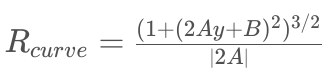
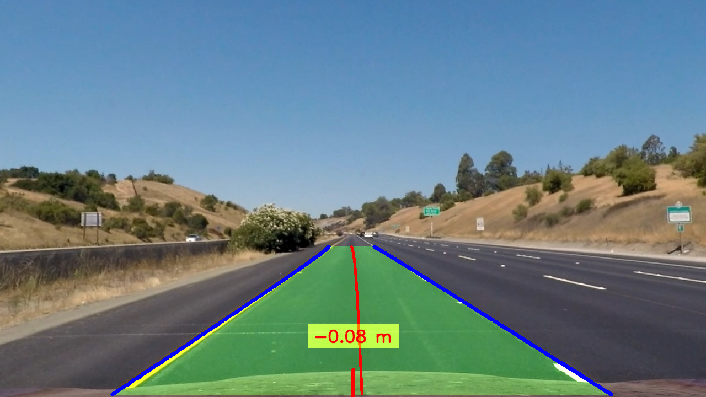

## Writeup Template

### You can use this file as a template for your writeup if you want to submit it as a markdown file, but feel free to use some other method and submit a pdf if you prefer.

---

**Advanced Lane Finding Project**

The goals / steps of this project are the following:

* Compute the camera calibration matrix and distortion coefficients given a set of chessboard images.
* Apply a distortion correction to raw images.
* Use color transforms, gradients, etc., to create a thresholded binary image.
* Apply a perspective transform to rectify binary image ("birds-eye view").
* Detect lane pixels and fit to find the lane boundary.
* Determine the curvature of the lane and vehicle position with respect to center.
* Warp the detected lane boundaries back onto the original image.
* Output visual display of the lane boundaries and numerical estimation of lane curvature and vehicle position.

[//]: # "Image References"

[image1]: ./doc/self_drive_1.png "Undistorted"
[image2]: ./doc/self_drive_2.png "Road Transformed"
[image3_prev]: ./doc/self_drive_4.png "Crop with ROI"
[image3]: ./doc/self_drive_3.png "Binary Example"
[image3_cam]: ./doc/self_drive_7.png "Script to generate transform"
[image3_cam2]: ./doc/self_drive_6.png "Script to generate transform&quot;"
[image4]: ./examples/warped_straight_lines.jpg "Warp Example"
[image5]: ./examples/color_fit_lines.jpg "Fit Visual"
[image6]: ./doc/self_drive_10.png "Output"
[video1]: ./project_video.mp4 "Video"

## [Rubric](https://review.udacity.com/#!/rubrics/571/view) Points

------

### Camera Calibration

#### 1. Briefly state how you computed the camera matrix and distortion coefficients. Provide an example of a distortion corrected calibration image.

I find the 9x6 chessboard using OpenCV routine (probably use a Harris corner detection). At the same time I generate the 3D planar Z=0 of the chessboard corners.

I find the chessboard corners of each calibrate image and finally I have the correspondence between 3D world and 2D image projection of each image.

I use the calibrateCamera that use triangulation algorithm to estimate the intrinsic parameters and distortion parameters.

![alt text][image1]

The full script can be found in `scripts/1_camera_calibration.py`.

### Pipeline (single images)

#### 1. Provide an example of a distortion-corrected image.

To demonstrate this step, I will describe how I apply the distortion correction to one of the test images like this one:
![alt text][image2]

#### 2. Describe how (and identify where in your code) you used color transforms, gradients or other methods to create a thresholded binary image.  Provide an example of a binary image result.

Before the perspective transform I crop using a ROI to remove useless areas.

![alt text][image3_prev]

After the perspective transform I do the following postprocess. The reason is because I obtain better results and it's more "easy" find same width lines.The steps are the following:

- Gaussian bluring: To reduce noise.
- Achromatic threshold for white lines using: `(np.std(frame_blur, axis=-1) < 50) & (frame_blur[..., 0] > 190) & (frame_blur[..., 1] > 190) & (frame_blur[..., 2] > 190)`
- Color space change to HSV in order to find yellow lines.
- Yellow thresholding using HSV range: `cv2.inRange(frame_hsv, np.array([15, 93, 0], dtype="uint8"), np.array([75, 255, 255], dtype="uint8")) > 0`.
- Some morphological operation to perform line continuity. Close with vertical kernel. 

This function can be found in: `lib/pipeline.py` `__apply_threshold(self, frame)`line 21.![alt text][image3]

#### 3. Describe how (and identify where in your code) you performed a perspective transform and provide an example of a transformed image.

In order to easy try differents approximations, I create an script called `scripts/2_camera_perspective.py`.

Is an easy point picker that help to found an nice geometrical transform.

![alt text][image3_cam]

First we select 4 points in a original image, it's more easy if we use a straight lanes image. Don't worry if the 0-3 points are not in the "final" of the image, we interpolate the line to fix that.

Secondly we compute the corrected points using a rectangle. The vertical side is the length of 0-1 points and the horizontal side is the length between 0 and 3. And we add a margin.

Finally we use this correspondence to find a Perspective matrix (using Gold Standard algorithm and ransac).

In order to create a ROI in original coordinates, we use the inverse transform to compute the limits of the output image.

![alt text][image3_cam2]

#### 4. Describe how (and identify where in your code) you identified lane-line pixels and fit their positions with a polynomial?

First I use the vertical slice histogram aproximation to get the first polinomial curve. I add some improvement like:

- Speed approximator: The sliding is from bottom to top, normally the curve is more straight in the bottom and their curve increase at top. I estimate the difference of the previous steps to get an increment factor to approximate better the position of the window using the previous window step.
- Fusion between lines: It's is an error process each lane independently, there are a very high correlation between both lanes. I use this information to fix share information between lanes and approximate better.

During the polynomial approach, I use the the previous polynomial + speed estimation using finite differentiation between two differents time to approximate the location of the new lane. At the same time I add some lateral margins to compute the candidate points.

Previous to generate the new polynomial I rasterize from bottom to top in order to fuse information between lanes and remove outliers using median.

Now I use numpy polyfit to approximate the new polygon with 2 order.

Both function can be found in `lib/lanes_estimator.py` ` compute_from_hist`and `compute_from_poly` respectively.

![alt text][image5]

#### 5. Describe how (and identify where in your code) you calculated the radius of curvature of the lane and the position of the vehicle with respect to center.

The radius of curvature is approximate using the A, B, C coefficients of the polynomial approximation. 

But the polynomial are generated in image coordinates. It's difficult to translate the polynomial from image coordinates to world coordinates. To avoid easily this problem I use the image coordinates polynomial to generate all the y-points of the image, and the I convert this points to world coordinates and I approximate the world coordinates polynomial.

I use the coefficients of this polygon to approximate the curve using the following equation, this equation find the radius of the tangent circle at an specific point of this polynomial.

The position of the vehicule with respect the center I approximate:

- Center of the car: is the middle-x and bottom-y of cenital image.
- Center of the lane: is the mean between x coordinate of bottom points lanes.

Finally I use a factor to transform pix to meters.

This function can be found in `lib/lanes_estimator.py` in the function ` __compute_curvature`and `compute_relative_center`.

#### 6. Provide an example image of your result plotted back down onto the road such that the lane area is identified clearly.

I create a small library to process video and obtain the following information:

- Beatiful image output.
- Lane information
- Curvature.
- Center

To use, you only have to view `main.py`.

![alt text][image6]

---

### Pipeline (video)

#### 1. Provide a link to your final video output.  Your pipeline should perform reasonably well on the entire project video (wobbly lines are ok but no catastrophic failures that would cause the car to drive off the road!).

Here's a [link to my video result](./output_images/project_video_output.mp4)

---

### Discussion

#### 1. Briefly discuss any problems / issues you faced in your implementation of this project.  Where will your pipeline likely fail?  What could you do to make it more robust?

Use classical computer vision in a non controled environment is supertricky, I think that the best way to obtain a nice segmentation of the lane is using a more powerfull tecniques like deep learning.

The segmentation is the key, all the next steps can be very nice deisgned but if your segmentation is not good all going to fail.

Probably take more time in the segmantion process and explore another color spaces could improve.

Use different temporal smooth approach to avoid jittering and another brute changes.

More testing in catastrophic cases:

-  What happen if i don't detect the line Inially?
- Can the left lane jump to right lane for segmentation inconsistences?